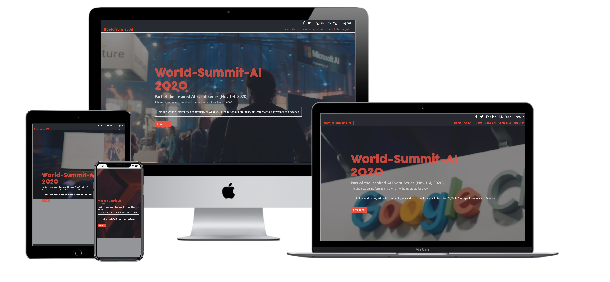

# World-Summit-AI
This is an HTML &amp; CSS Capstone Project and it is a World Summit AI website with inspiration from the original website which the event is one in which the brightest brains in AI gather to talk about the global AI ecosystem of Enterprise, BigTech, Startups, Investors and Science.

I was given [this design](https://www.behance.net/gallery/29845175/CC-Global-Summit-2015) of [Cindy Shin](https://www.behance.net/gallery/29845175/CC-Global-Summit-2015)'s to follow, mirroring its structure, typography and colors as I built my own conference website.

After some cursory research, I discovered that a World Ai Summit would be taking place later thois year, and I decided this would be the conference for which I would build my website.

## Video Presentation

Watch my video [presentation](https://www.loom.com/share/579ed1b7184b45dc91f91fbd4105c6c8) of the project to hear more about this assignment and how I approached it.

## Built With

- HTML/CSS
- Bootstrap
- Stylelint, Webhint, Lighthouse
- VSCode (with Prettier, Stylelint and Live Server extensions)
- Google Chrome (with DevTools and Pesticide)

## Live Demo

See the project in action by visiting the [live demo](https://lucid-blackwell-2cd9e2.netlify.app/)!

## Getting Started

**To get this project set up on your local machine, follow these simple steps:**

1. Open Terminal.

2. Navigate to your desired location to download the contents of this repository.

3. Copy and paste the following code into the Terminal:

    git clone https://github.com/Haywhizzz/World-Summit-AI

4. Hit enter.

5. Once the repository has been cloned, open main.html in a browser of your choosing. From there, you may also navigate to the "About" and "Tickets" pages.

6. Enjoy!

### Prerequisites

- A computer, a smartphone, or another similar device.
- Access to the internet.

## Author

👤 **Oyeleke Ayomide**

> Hello, World! 

> My name's Ayomide. Hire me!

- Github: [@Haywhizzz](https://github.com/Haywhizzz )
- Twitter: [@Haywhizzz](https://twitter.com/Haywhizzz)
- Linkedin: [Haywhizzz](https://www.linkedin.com/in/oyeleke-ayomide-b962421a6/)

## 🤝 Contributing

Contributions, issues and feature requests are always welcome!

I love meeting other developers, especially ones that give me advice on how to improve my work.

Drop me an [issue](issues/)!

## Show your support

Finally, if you've read this far, don't forget to give this repo a ⭐️. They're free . . . I think.

## Acknowledgments

- Thanks are owed to the designer, [Cindy Shin](https://www.behance.net/gallery/29845175/CC-Global-Summit-2015), for her design.
- Thanks to [techsini.com](https://techsini.com/multi-mockup/) for their useful URL-based website mockup tool.
- Content was largely inspired by [this](https://worldsummit.ai/). The text has been adapted and the names have been changed.
- To my Stand-Up Team: Amita, Brandon, Robert, Sercan and myself. As always, thanks go to them for their feedback and support.
- README Content was taken from Amita Roy, one of my stand up team member.
## 📝 License

This project is [MIT](lic.url) licensed.